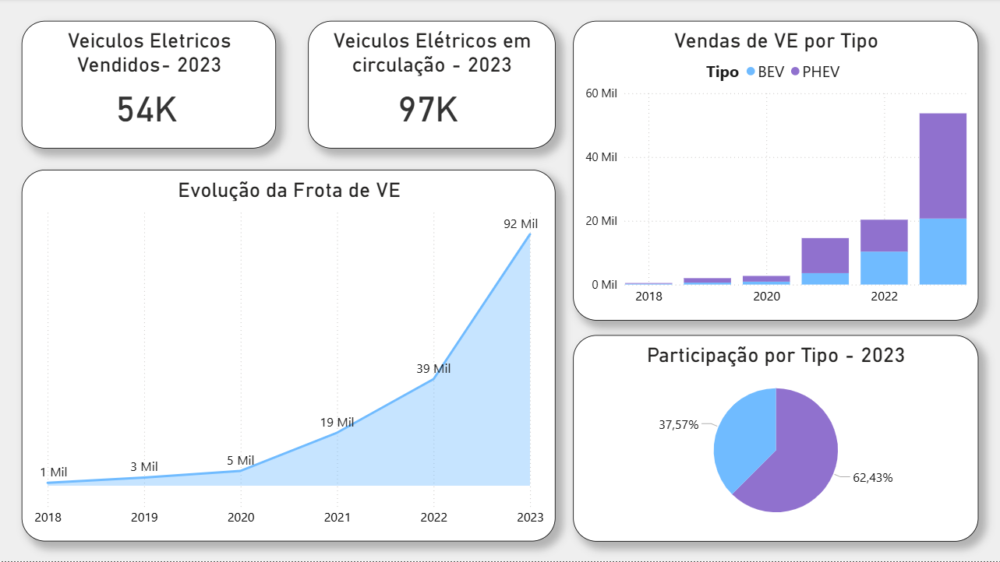

# Dashboard de Veículos Elétricos no Brasil

Este projeto apresenta um dashboard desenvolvido em Power BI com foco na evolução do mercado de veículos elétricos no Brasil, analisando vendas, frota em circulação e participação por tipo de motorização ao longo dos anos.

## Objetivo

Explorar dados históricos sobre veículos elétricos no Brasil para identificar o crescimento do mercado e a composição das vendas entre BEV e PHEV.

## Indicadores analisados

- Veículos elétricos vendidos em 2023
- Veículos elétricos em circulação em 2023
- Evolução da frota de veículos elétricos
- Vendas por tipo de motorização
- Participação por tipo em 2023

## Dashboard

## Ferramentas utilizadas

- Power BI
- Kaggle
- CSV
- GitHub

## Base de dados

Dataset utilizado: Global EV Data 2024

## Insights principais

- O mercado de veículos elétricos no Brasil apresentou forte crescimento nos últimos anos.
- A frota em circulação acelerou significativamente entre 2021 e 2023.
- As vendas estão concentradas entre BEV e PHEV, com predominância de PHEV no recorte analisado.

## Autor

Desenvolvido por Lucas Batistti.
